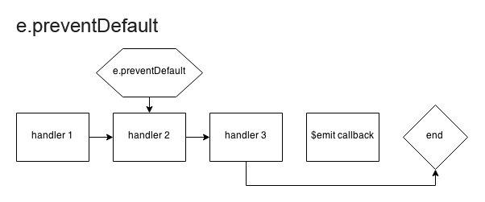
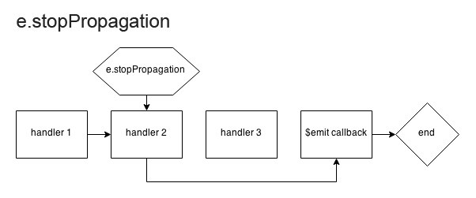

E$
==

> A lightweight event emitter for clients and servers.

Overview
--------

> E$ can be used as a standalone constructor, or to extend prototypical objects.

```javascript
var emoneyStandalone = E$({
  handleE$: function( e ) { ... }
});

var emoneyExtended = (function() {

  function Constructor() {
    E$.construct( this );
  }

  E$ishConstructor.prototype = E$.create({
    handleE$: function( e ) { ... }
  });

  return new Constructor();

}());
```

> E$ provides a clean way to interface with object instances.

```javascript
emoneyExtended
.$when( 'loading' , function( e , pct ) {
  console.log( 'loading... (' + pct + '%)' );
})
.$when( 'ready' , function( e ) {
  console.log( 'ready!' );
})
.$when( 'error' , function( e , err ) {
  console.error( err.stack );
});
```

> E$ instances can communicate via the `handleE$` method.

```javascript
emoneyExtended.$watch( emoneyStandalone );

// when emoneyStandalone emits an event
emoneyStandalone.$emit( 'gnarly' , [ 'something' , { rad: true }]);

// emoneyExtended.handleE$ is executed with arguments:
// [ event , something , { rad: true }]
```

Methods
-------

### Static Methods

#### E$.create( prototype )

> creates a new object that extends the E$ prototype.

```javascript
E$ishConstructor.prototype = E$.create({
  method1: function() { ... },
  method2: function() { ... },
  handleE$: function( e ) { ... }
});
```

#### E$.construct( instance )

> defines required properties for an E$ instance.

```javascript
function E$ishConstructor() {
  E$.construct( this );
  // ...
}
```

#### E$.is( subject )

> determines whether subject is E$-ish.

```javascript
var emoney = E$({ gnarly: true });
var emoneyIsh = new E$ishConstructor();
var somethingElse = new SomethingElse();

emoney instanceof E$;     // true
E$.is( emoney );          // true

emoneyIsh instanceof E$;  // false
E$.is( emoneyIsh );       // true

E$.is( somethingElse );   // false
```

### Public Methods

> All public methods can be chained.

#### .$when( events , [ args ] , [ handler ])

> adds an event listener.

| Parameter | Type | Description | Required |
| --------- | ---- | ----------- | -------- |
| `events` | `String`<br>`Array` | The event(s) to be handled. | __yes__ |
| `args` | `Variant`<br>`Array` | The argument(s) to be bound to the event handler. | _no_ |
| `handler` | `Function`<br>`E$` | The event handler.<br>If `E$.is( handler ) == true`, the event will be bound to `instance.handleE$`.<br>If `handler` is falsy, the event will be bound to `emoney.handleE$`. | _no_ |

```javascript
// basic use
emoney.$when( 'gnarly' , function( e ) { ... });

// bind an argument to multiple events
emoney.$when([ 'gnarly' , 'rad' ] , 'arg' , function( e , arg ) { ... });

// bind multiple arguments to the wildcard event
emoney.$when( '*' , [ 'arg1' , 'arg2' ] , function( e , arg1 , arg2 ) { ... });
```

#### .$once( events , [ args ] , [ handler ])

> adds an event listener that is removed after the first time it is invoked.

| Parameter | Type | Description | Required |
| --------- | ---- | ----------- | -------- |
| `events` | `String`<br>`Array` | The event(s) to be handled. | __yes__ |
| `args` | `Variant`<br>`Array` | The argument(s) to be bound to the event handler. | _no_ |
| `handler` | `Function`<br>`E$` | the event handler | _no_ |

```javascript
// basic use
emoney.$once( 'gnarly' , function( e ) { ... });

// bind an argument to multiple events
emoney.$once([ 'gnarly' , 'rad' ] , 'arg' , function( e , arg ) { ... });

// bind multiple arguments to the wildcard event
emoney.$once( '*' , [ 'arg1' , 'arg2' ] , function( e , arg1 , arg2 ) { ... });
```

#### .$emit( events , [ args ] , [ callback ])

> emits an event.

| Parameter | Type | Description | Required |
| --------- | ---- | ----------- | -------- |
| `events` | `String`<br>`Array` | the event(s) to be emitted | __yes__ |
| `args` | `Variant`<br>`Array` | the argument(s) to be passed to the event handler | _no_ |
| `callback` | `Function` | a function to be executed at the end of the event chain (see [event behavior](#behavior)) | _no_ |

```javascript
// basic use
emoney.$emit( 'gnarly' , function( e ) { ... });

// pass an argument to multiple event handlers
emoney.$emit([ 'gnarly' , 'rad' ] , 'arg' , function( e ) { ... });

// pass multiple arguments to an event handler
emoney.$emit( 'gnarly' , [ 'arg1' , 'arg2' ] , function( e ) { ... });
```

#### .$dispel( events , [ wildcard ] , [ handler ])

> removes an event listener.

| Parameter | Type | Description | Required |
| --------- | ---- | ----------- | -------- |
| `events` | `String`<br>`Array`<br>`null` | The event(s) to be removed. | __yes__ |
| `wildcard` | `Boolean` | A boolean value denoting whether handlers bound to the wildcard event should be removed. | _no_ |
| `handler` | `Function`<br>`E$` | the event handler | _no_ |

```javascript
// remove any gnarly listeners bound to handlerFunc
emoney.$dispel( 'gnarly' , handlerFunc );

// remove all gnarly or rad listeners bound to any handler
emoney.$dispel([ 'gnarly' , 'rad' ]);

// remove all listeners bound to handlerFunc except wildcard listeners
emoney.$dispel( null , handlerFunc );

// remove all listeners bound to handlerFunc
emoney.$dispel( null , true , handlerFunc );

// remove all listeners
emoney.$dispel( null , true );
```

#### .$watch( emitters )

> starts listening to an E$ instance. `emitter` events will be handled by `listener.handleE$`.

| Parameter | Type | Description | Required |
| --------- | ---- | ----------- | -------- |
| `emitters` | `E$`<br>`Array` | The target E$ instance(s). | __yes__ |

```javascript
// watch a single emitter
listener.$watch( emitter1 );

// watch multiple emitters
listener.$watch([ emitter1 , emitter2 ]);
```

#### .$ignore( emitters )

> stops listening to an E$ instance.

| Parameter | Type | Description | Required |
| --------- | ---- | ----------- | -------- |
| `emitters` | `E$`<br>`Array` | The target E$ instance(s). | __yes__ |

```javascript
// ignore a single emitter
listener.$ignore( emitter1 );

// ignore multiple emitters
listener.$ignore([ emitter1 , emitter2 ]);
```

Events
------

### Properties

| Property | Type | Default | Description |
| -------- | ---- | ------- | ----------- |
| `target` | `Object` | `n/a` | The event target. |
| `type` | `String` | `n/a` | The event type. |
| `defaultPrevented` | `Boolean` | `false` | A flag denoting whether default was prevented. |
| `cancelBubble` | `Boolean` | `false` | A flag denoting whether propagation was stopped. |
| `timeStamp` | `Float` | `n/a` | The time at which the event was first triggered. |

### Methods

#### .preventDefault()

> prevents the $emit callback from being executed.

```javascript
emoney
.$when( 'gnarly' , function( e ) {
  e.preventDefault();
  console.log( 'handler1' );
})
.$when( 'gnarly' , function( e ) {
  console.log( 'handler2' );
})
.$emit( 'gnarly' , function( e ) {
  console.log( 'callback' );
});

/*
**  > 'handler1'
**  > 'handler2'
*/
```

#### .stopPropagation()

> stops execution of the event chain and executes the emit callback.

```javascript
emoney
.$when( 'gnarly' , function( e ) {
  e.stopPropagation();
  console.log( 'handler1' );
})
.$when( 'gnarly' , function( e ) {
  console.log( 'handler2' );
})
.$emit( 'gnarly' , function( e ) {
  console.log( 'callback' );
});

/*
**  > 'handler1'
**  > 'callback'
*/
```

### Behavior






Build & Test
------------

> Build configs can be found in [Gruntfile.js](Gruntfile.js)

### default

> Builds dev and prod releases, then runs tests.

  grunt

### test

> Builds dev release and then runs tests.

  grunt test

### debug

> Builds dev release, runs tests, then watches source files for changes.

  grunt debug
