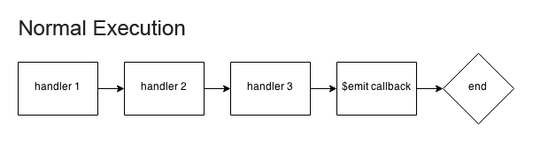

E$
==
> A lightweight, isomorphic event emitter.

[](https://travis-ci.org/bernardmcmanus/emoney)

Overview
--------

> E$ can be used standalone or inherited by other classes.

```js
// Standalone
const emoney = E$({
	handleE$() { ... }
});

// Inherited
class E$Extended extends E$ {
	handleE$() { ... }
}
```

> E$ provides a clean way to interface with object instances.

```js
emoney
	.$when('loading', (e, pct) => console.log('loading... (%s%)', pct))
	.$when('ready', () => console.log('ready!'))
	.$when('error', (e, err) => console.error(err.stack));
```

> E$ instances can communicate via the `handleE$` method.

```js
const emitter = E$();
const watcher = E$({
	handleE$(e, str, obj) {
		expect(str).to.eql('awesome');
		expect(obj).to.eql({ rad: true });
	}
});
watcher.$watch(emitter);
emitter.$emit('gnarly', ['awesome', { rad: true }]);
expect(watcher.handleE$).to.have.been.called.once;
```

> E$ can be used to create a DOM-like event tree.

```js
const emitter = E$();
const watcher1 = E$();
const watcher2 = E$();
const spy = sinon.spy();

watcher2
	.$watch(watcher1)
	.$when('gnarly', spy);

watcher1
	.$watch(emitter)
	.$when('gnarly', e => e.stopPropagation());

emitter.$emit('gnarly', () => expect(spy).to.have.not.been.called);
```

Methods
-------

### _`(static)`_ E$.is(subject) &#8594; _`{boolean}`_

> Returns true if subject is E$-ish, false otherwise.

```js
const emoney = E$();
const emoneyIsh = new E$Extended();
const somethingElse = new SomethingElse();

emoney instanceof E$;     // true
E$.is(emoney);            // true

emoneyIsh instanceof E$;  // false
E$.is(emoneyIsh);         // true

E$.is(somethingElse);     // false
```

### .$when(events, args<sub>_opt_</sub>, fn<sub>_opt_</sub>) &#8594; _`{instance}`_

> Adds an event listener.

| Parameter | Type | Description | Required |
| --------- | ---- | ----------- | -------- |
| `events` | `string`<br>`array` | The event(s) to be handled. | __yes__ |
| `args` | `variant`<br>`array` | The argument(s) to be bound to the event handler. | no |
| `fn` | `function`<br>`E$` | The event handler.<br>If `E$.is(fn) == true`, the event will be bound to `instance.handleE$`.<br>If `fn` is falsy, the event will be bound to `emoney.handleE$`. | no |

```js
// basic use
emoney.$when('gnarly', () => { ... });

// bind an argument to multiple events
emoney.$when(['gnarly', 'rad'], 'arg', () => { ... });
```

### .$once(events, args<sub>_opt_</sub>, fn<sub>_opt_</sub>) &#8594; _`{instance}`_

> Adds an event listener that is removed after the first time it is invoked.

| Parameter | Type | Description | Required |
| --------- | ---- | ----------- | -------- |
| `events` | `string`<br>`array` | The event(s) to be handled. | __yes__ |
| `args` | `variant`<br>`array` | The argument(s) to be bound to the event fn. | no |
| `fn` | `function`<br>`E$` | The event handler. | no |

```js
// basic use
emoney.$once('gnarly', () => { ... });

// bind an argument to multiple events
emoney.$once(['gnarly', 'rad'], 'arg', () => { ... });
```

### .$emit(events, args<sub>_opt_</sub>, callback<sub>_opt_</sub>) &#8594; _`{instance}`_

> Emits an event.

| Parameter | Type | Description | Required |
| --------- | ---- | ----------- | -------- |
| `events` | `string`<br>`array` | The event(s) to be emitted. | __yes__ |
| `args` | `variant`<br>`array` | The argument(s) to be passed to the event handler. | no |
| `callback` | `function` | A function to be executed at the end of the event chain (see [event behavior](#behavior)). | no |

```js
// basic use
emoney.$emit('gnarly', () => { ... });

// pass an argument to multiple event handlers
emoney.$emit(['gnarly', 'rad'], 'arg', () => { ... });

// pass multiple arguments to an event handler
emoney.$emit('gnarly', ['arg1', 'arg2'], () => { ... });
```

### .$dispel(events, wild<sub>_opt_</sub>, fn<sub>_opt_</sub>) &#8594; _`{instance}`_

> Removes an event listener.

| Parameter | Type | Description | Required |
| --------- | ---- | ----------- | -------- |
| `events` | `string`<br>`array`<br>`null` | The event(s) to be removed. | __yes__ |
| `wild` | `boolean` | A boolean value denoting whether handlers bound to the wildcard event should be removed. | no |
| `fn` | `function`<br>`E$` | The event handler. | no |

```js
// remove any gnarly listeners bound to fn
emoney.$dispel('gnarly', fn);

// remove all gnarly or rad listeners bound to any handler
emoney.$dispel(['gnarly', 'rad']);

// remove all listeners bound to fn except wildcard listeners
emoney.$dispel(null, fn);

// remove all listeners bound to fn
emoney.$dispel(null, true, fn);

// remove all listeners
emoney.$dispel(null, true);
```

### .$watch(emitters) &#8594; _`{instance}`_

> Starts watching E$ instance(s).

| Parameter | Type | Description | Required |
| --------- | ---- | ----------- | -------- |
| `emitters` | `E$`<br>`array` | The E$ instance(s) to watch. | __yes__ |

```js
// watch a single emitter
listener.$watch(emitter1);

// watch multiple emitters
listener.$watch([emitter1, emitter2]);
```

### .$unwatch(emitters) &#8594; _`{instance}`_

> Stops watching E$ instance(s).

| Parameter | Type | Description | Required |
| --------- | ---- | ----------- | -------- |
| `emitters` | `E$`<br>`array` | The E$ instance(s) to stop watching. | __yes__ |

```js
// stop watching a single emitter
listener.$unwatch(emitter1);

// stop watching multiple emitters
listener.$unwatch([emitter1, emitter2]);
```

Events
------

### Properties

| Property | Type | Default | Description |
| -------- | ---- | ------- | ----------- |
| `target` | `E$` | `n/a` | The event target. |
| `type` | `string` | `n/a` | The event type. |
| `defaultPrevented` | `boolean` | `false` | A flag denoting whether default was prevented. |
| `cancelBubble` | `boolean` | `false` | A flag denoting whether propagation was stopped. |
| `timeStamp` | `number` | `n/a` | The time at which the event was first triggered. |

### Methods

#### .preventDefault()

> Prevents the $emit callback from being executed.

```js
emoney
	.$when('gnarly', (e) => {
		e.preventDefault();
		console.log('fn1');
	})
	.$when('gnarly', () => console.log('fn2'))
	.$emit('gnarly', () => console.log('cb'));

/**
 * > 'fn1'
 * > 'fn2'
 */
```

#### .stopPropagation()

> Stops execution of the event chain and executes the emit callback.

```js
emoney
	.$when('gnarly', (e) => {
		e.stopPropagation();
		console.log('fn1');
	})
	.$when('gnarly', () => console.log('fn2'))
	.$emit('gnarly', () => console.log('cb'));

/**
 * > 'fn1'
 * > 'cb'
 */
```

### Behavior



Build & Test
------------

	npm i && npm run build
